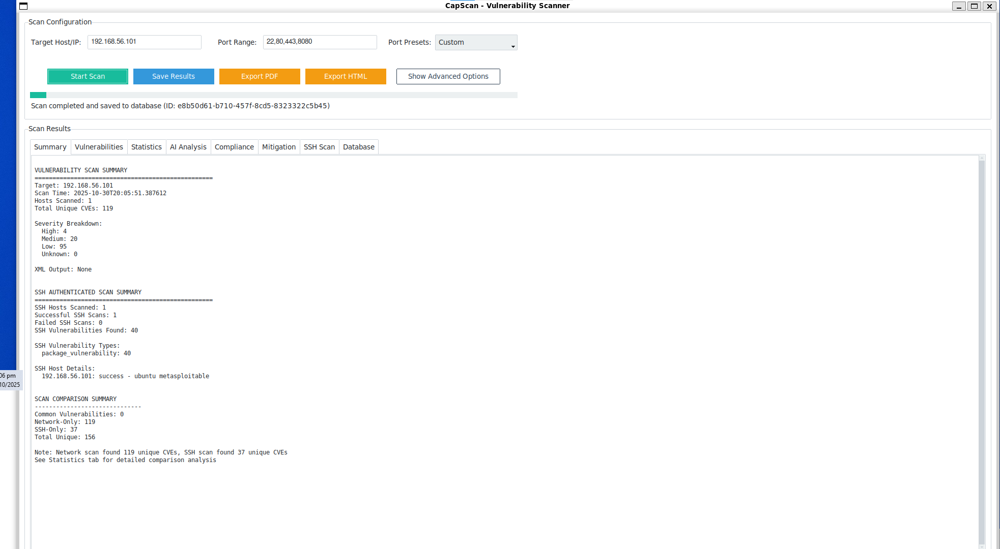

# CapScan - Vulnerability Scanner

CapScan is a comprehensive vulnerability scanner built with Python that uses nmap as its scanning engine. It provides both command-line interface (CLI) and graphical user interface (GUI) for conducting security assessments and vulnerability scans.

## Features

### 🔍 **Vulnerability Scanning**
- **Nmap Integration**: Uses python-nmap for robust network scanning (vulners NSE)
- **Multiple Scan Types**: Quick scans, common ports, and comprehensive port scans
- **Custom Port Ranges**: Specify custom port ranges for targeted scanning
- **Vulnerability Detection**: Identifies potential security issues and misconfigurations
- **Scoring System**: Keyword- and CVE year-based scoring for prioritization

### 🤖 **AI-Assisted Analysis**
- **Risk Assessment**: AI summarizes risk, impact, and exploitability
- **Mitigation Guidance**: Actionable immediate/short-term/long-term recommendations
- **Compliance Checks**: OWASP, NIST, PCI_DSS, ISO27001, PH_DPA summaries
- **Pluggable Backend**: Uses PhindAI wrapper by default; mock fallback offline

### 💾 **Database Integration**
- **SQLCipher3 Support**: Encrypted database storage for secure data retention
- **Comprehensive Schema**: Stores scan results, host information, port details, and vulnerabilities
- **Password Protection**: Secure database access with password authentication
- **Data Persistence**: Maintain historical scan data and trends
 - **AI Artifacts**: Persists AI analyses and mitigation plans for each scan

### 🖥️ **User Interfaces**
- **Command Line Interface**: Full CLI support with argument parsing
- **Graphical User Interface**: Modern GUI built with ttkbootstrap
- **Interactive Mode**: User-friendly interactive scanning workflow
- **Real-time Progress**: Live progress tracking during scans

### 📊 **Results Management**
- **Multiple Export Formats**: JSON, XML, PDF, and HTML reports
- **Database Storage**: Automatic saving to encrypted database
- **File Export**: Manual export of scan results to files
- **Summary Reports**: Comprehensive scan summaries and statistics
- **Professional Reports**: Branded PDF/HTML with AI, compliance, mitigation sections

## Installation

### Prerequisites
- Python 3.7 or higher
- nmap installed on your system
- SQLCipher3 support

### Setup
1. Clone the repository:
```bash
git clone https://github.com/dvbondoy/capscan.git
cd capscan
```

2. Install dependencies:
```bash
pip install -r requirements.txt
```

3. Ensure nmap is installed on your system:
```bash
# Ubuntu/Debian
sudo apt-get install nmap

# macOS
brew install nmap

# Windows
# Download from https://nmap.org/download.html
```

## Usage

### Command Line Interface

#### Basic Scan
```bash
python main.py 192.168.1.1
```

#### Advanced Options
```bash
python main.py 192.168.1.1 --ports "22,80,443,8080" --max-reports 5 --no-db
```

#### Database Operations
```bash
# Show database information
python main.py --db-info

# Provide database password via CLI
python main.py 192.168.1.1 --db-password "your_password"
```

#### Available CLI Arguments
- `target`: Target host or IP address
- `--ports`: Comma-separated port list (default: "22,80,443,8080")
- `--max-reports`: Maximum reports per port (default: 10)
- `--no-db`: Disable database saving
- `--db-info`: Show database statistics
- `--db-password`: Provide database password via CLI
- `--interactive`: Run in interactive mode

Notes:
- Default behavior launches the GUI if no flags are provided.
- AI analysis, compliance, and mitigation generation are available via the Python API. See example below.

### Graphical User Interface

#### Launch GUI
```bash
python gui.py
```

#### GUI Features
- **Target Configuration**: Enter host/IP and port ranges
- **Port Presets**: Quick selection of common port configurations
- **Scan Options**: Configure max reports and scoring options
- **Database Integration**: Connect/disconnect from database with password protection
- **Real-time Monitoring**: Live progress tracking and status updates
- **Results Management**: View, save, and export scan results
 - **Report Export**: Export PDF/HTML reports when dependencies are installed

## Database Schema

The application uses SQLCipher3 for encrypted data storage with the following schema:

### Tables
- **scan_results**: Main scan records with metadata
- **host_info**: Target host information and status
- **port_info**: Port details and service information
- **vulnerabilities**: Vulnerability findings and severity scores
 - **ai_analysis**: Risk/compliance analyses linked to scans
 - **mitigation_recommendations**: Action plans with priority and status

### Security
- All data is encrypted using SQLCipher3
- Password-protected database access
- No hardcoded credentials
- Secure password prompting

## Configuration

### Database Setup
1. First run will prompt for database password
2. Database file: `capscan.db` (encrypted)
3. Password is required for all database operations

### Scan Configuration
- **Default Ports**: 22, 80, 443, 8080
- **Max Reports**: 10 per port
- **Scoring**: Keyword + CVE-year-based scoring enabled by default

## File Structure

```
capscan/
├── main.py              # CLI entry point
├── gui.py               # GUI application
├── engine.py            # Scanning engine
├── database.py          # Database operations
├── ai_service.py        # AI analysis, compliance checks, mitigation
├── phind_ai.py          # PhindAI wrapper backend
├── requirements.txt     # Python dependencies
├── README.md           # This file
├── reports/             # PDF/HTML report exporters
├── compliance/          # Templates/framework helpers
├── mitigation/          # Mitigation workflows/templates
└── output/             # Scan results directory
```

## Dependencies

- **nmap**: Network scanning engine
- **sqlcipher3**: Encrypted database support
- **ttkbootstrap**: Modern GUI framework
- **python-nmap**: Python nmap interface
 - **reportlab**: PDF export
 - **jinja2**: HTML export
 - **requests, openai, pydantic**: AI backend helpers

## Security Considerations

- Database passwords are never hardcoded
- All scan data is encrypted at rest
- Interactive password prompting for security
- No sensitive data in logs or output files

## Examples

### Quick Vulnerability Scan
```bash
python main.py 192.168.1.100 --ports "22,80,443" --max-reports 5
```

### Comprehensive Network Assessment
```bash
python main.py 192.168.1.0/24 --ports "1-65535" --max-reports 20
```

### Database Analysis
```bash
python main.py --db-info
```

### Interactive Mode
```bash
python main.py --interactive
```

### Programmatic usage: AI analysis and reporting
```python
from engine import Scanner
from database import Database
from ai_service import AIService
from reports.report_generator import ReportGenerator

scanner = Scanner()
results = scanner.scan_host("192.168.1.1", ports="22,80,443")

# Optional AI analyses
ai = AIService()
ai_analysis = ai.analyze_vulnerabilities(results)
compliance = ai.check_compliance(results, standard="OWASP")

# Save to encrypted DB
with Database(password="your_password") as db:
    scan_id = db.save_scan_results(results)
    db.save_ai_analysis(scan_id, analysis_type="compliance", standard="OWASP", analysis_data=compliance)

# Export professional reports (requires reportlab/jinja2)
reporter = ReportGenerator()
paths = reporter.export_both_formats(results)
print(paths)
```

## Troubleshooting

### Common Issues
1. **Nmap not found**: Ensure nmap is installed and in PATH
2. **Database errors**: Check password and file permissions
3. **Permission denied**: Run with appropriate privileges for network scanning
4. **GUI not launching**: Check ttkbootstrap installation
5. **PDF export not available**: Install reportlab (`pip install reportlab`)
6. **HTML export not available**: Install jinja2 (`pip install jinja2`)

### Getting Help
- Check the documentation files in the project
- Review error messages for specific guidance
- Ensure all dependencies are properly installed

## Contributing

1. Fork the repository
2. Create a feature branch
3. Make your changes
4. Test thoroughly
5. Submit a pull request

## License

This project is licensed under the MIT License - see the LICENSE file for details.

## Acknowledgments

- Built with [python-nmap](https://github.com/nmmapper/python3-nmap)
- GUI powered by [ttkbootstrap](https://github.com/israel-dryer/ttkbootstrap)
- Database encryption via [SQLCipher3](https://github.com/rigglemania/pysqlcipher3)
- Network scanning by [nmap](https://nmap.org/)

---

**CapScan** - Professional vulnerability scanning made simple and secure.
